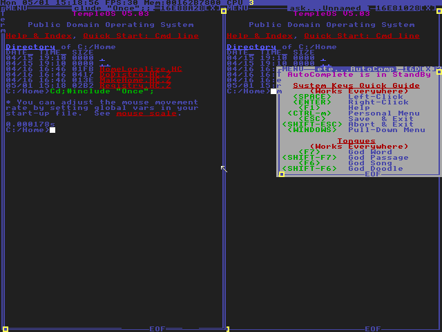
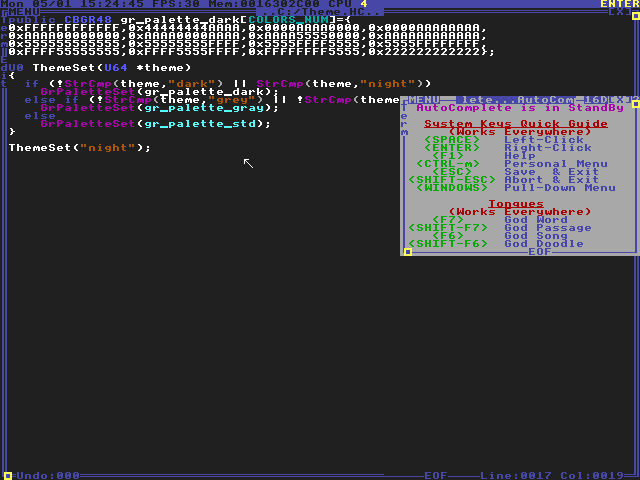
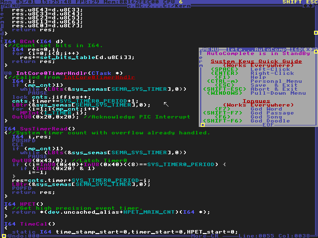

# Theme.HC

A dark theme switcher for TempleOS.

## Showcase

> Startup preview



<br>

> Editing Theme.HC



<br>

> Editing KMisc.HC.Z



## About

This is from a [youtube tutorial](https://www.youtube.com/watch?v=tEFxizFTFng), uploaded here for access cross-platform.

## Usage

Copy the file to ```C:/Home/Theme.HC``` of your TempleOS filesystem. If you don't know how, you can do it using my [TempleOS-Mounter](./https://github.com/joshjkk/TempleOS-Mounter) program.

### Switching themes

In TempleOS, you can switch to the dark theme manually with the following commands:

``` c
#include "::/Theme.HC";
```

For dark:

``` c
ThemeSet("dark");
```

For light (default):

``` c
ThemeSet("light");
```

### Switch on startup

In order to switch themes on startup, add the theme switching code in the ```C:/Once.HC.Z``` file:

``` c
//Put the following lines at the end of the file

#include "Theme.HC";
ThemeSet("dark");
```

> For an automatic dark theme

**You may see that the theme switches AFTER you are prompted for a tour.** In order to fix this, just *comment out* the code in the ```Tmp()``` function switch statement that asks you for the tour.
