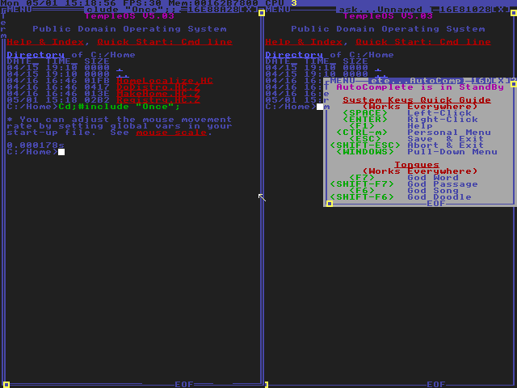
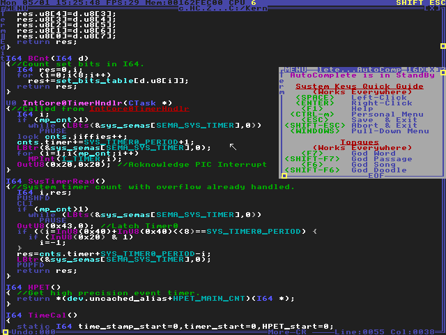
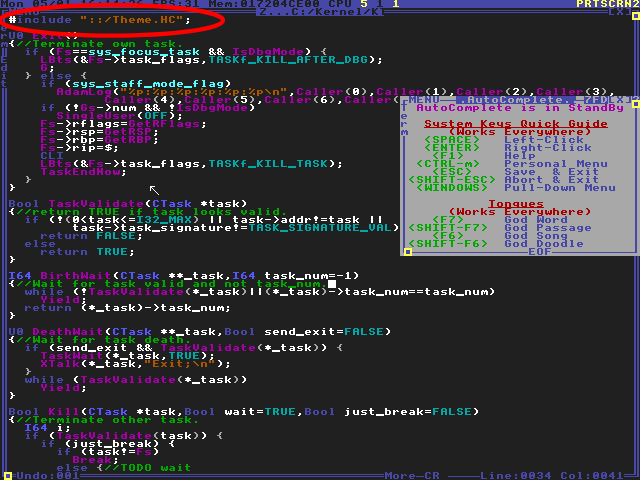
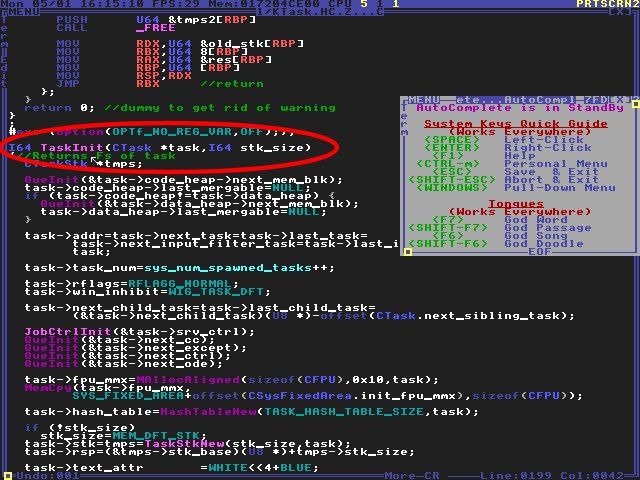
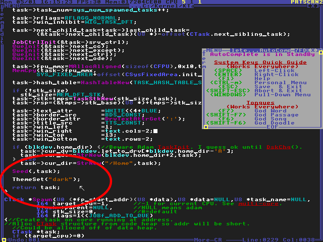

# Theme.HC

A dark theme switcher for TempleOS.

## Showcase



<br>



## About

This is from a [youtube tutorial](https://www.youtube.com/watch?v=tEFxizFTFng), uploaded here for access cross-platform.

## Installation

Copy the file to ```C:/Home/Theme.HC``` of your TempleOS filesystem. If you don't know how, you can do it using my [TempleOS-Mounter](./https://github.com/joshjkk/TempleOS-Mounter) program.

## Switching themes

In order to switch themes for all terminal windows, you need to edit a kernel file to set the colorscheme every time a new terminal is opened.

We can do this by setting the theme inside of ```C:/Kernel/KTask.HC.Z```:

### 1. Open ```C:/Kernel/KTask.HC.Z``` in the editor

``` c
Ed("::/Kernel/KTask.HC.Z");
```

<br>

### 2. Include Theme.HC



<br>

### 3. Scroll down and find the ```TaskInit``` function



<br>

### 4. Set the theme inside of ```TaskInit```

``` c
ThemeSet("dark");
```



<br>

### 5. Reboot

When you reboot TempleOS, you should be greeted with a beautiful dark theme.